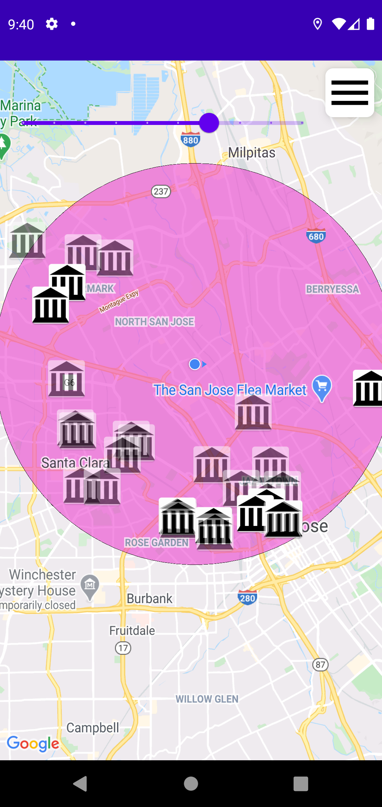

# Week 5 Homework: Due: 02/03
## Create a place finder application that uses Google Maps API
- Places
- Geocode
Displays a map on the screen and helps user find places nearby.
Application should use a contextual menu(no actionbar) to select from 7 different place types
Application should also use a SeekBar to determine the radius

## This application should ;
-Display current user location
-Use runtime permissions for location
- Open a fragment displaying images of place and default images if no images are available, allow user to open google maps with directions to the location from current location
-Pin the found locations on the map
use RxJava
- Be implemented in MVVM architecture
- Have a unique implementation by each developer

## Implementation Details
- Each attraction has its own colored radius to make it easier to recall what the user is searching, and the area covered
- Camera zooms in on startup only, allowing for free exploration but also simplifying the starting point
- Icons make it easy to distinguish activity
- Locations that may not be open are faded to make it simpler to select open locations to visit

## Basic display
Basic option

Place Display

